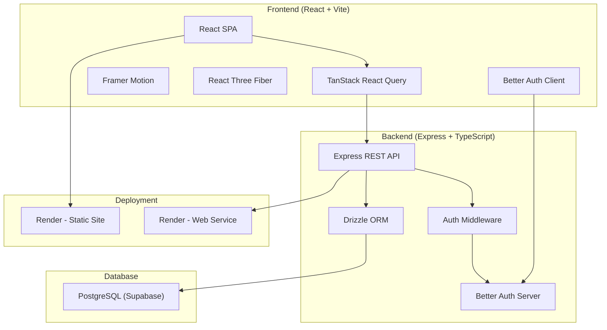
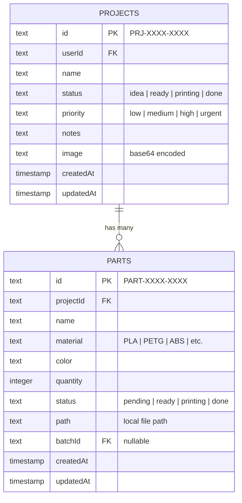
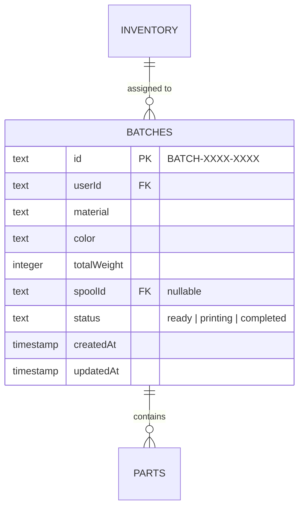
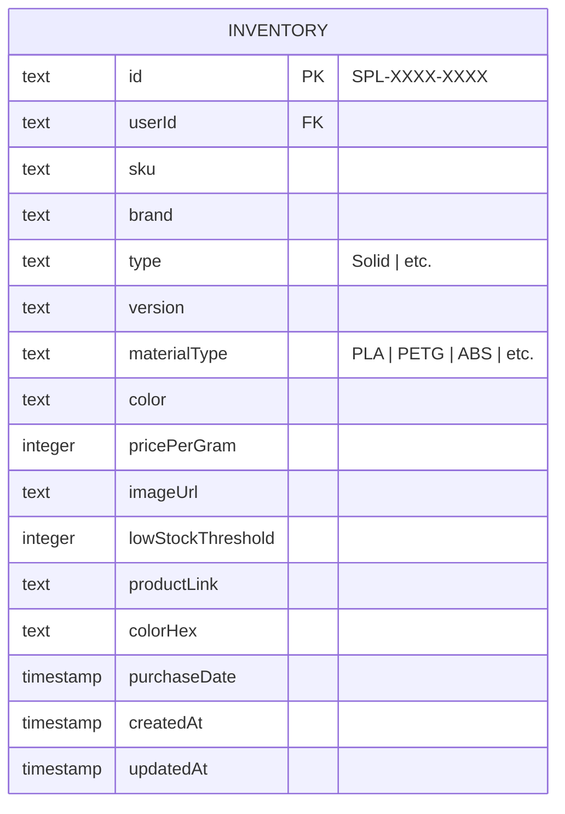
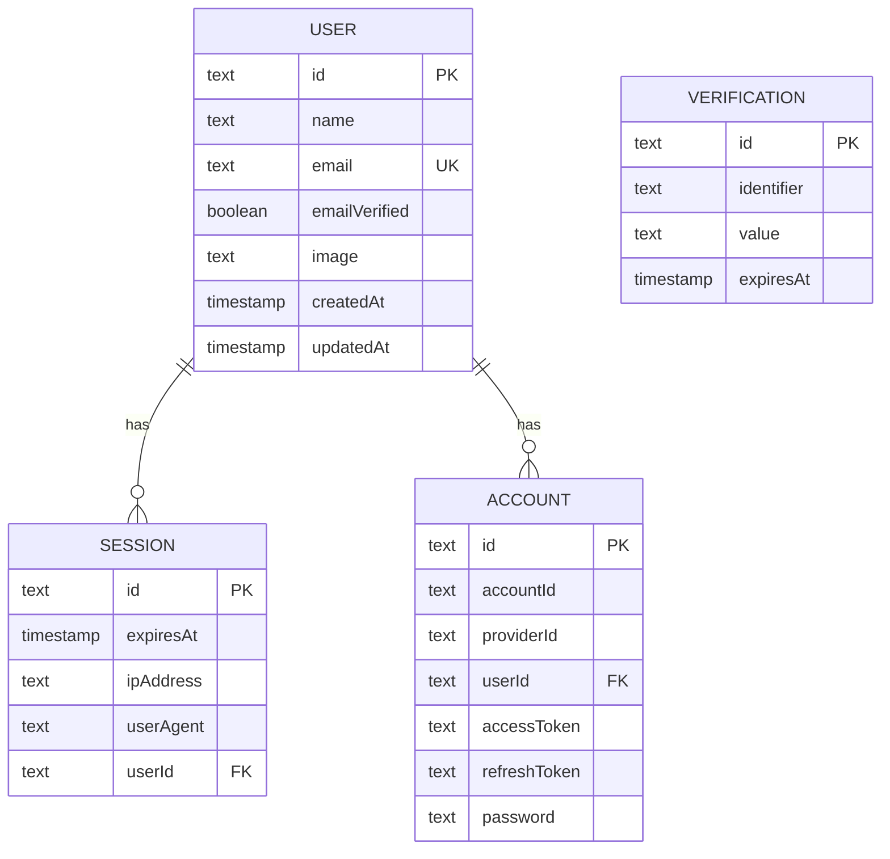
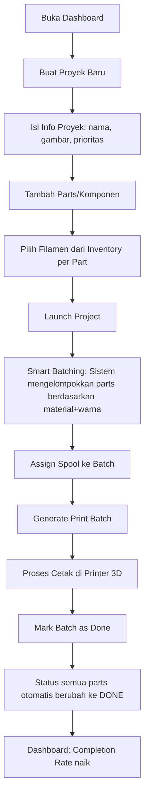
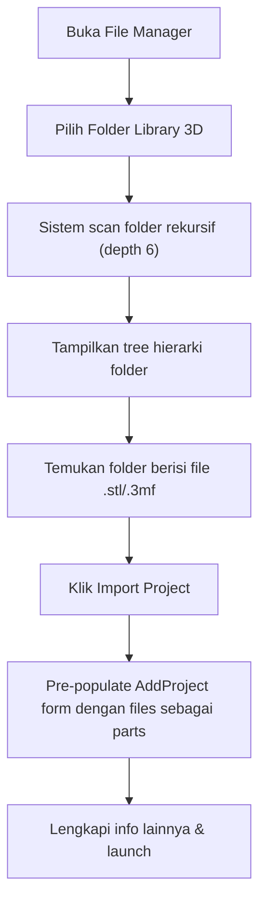
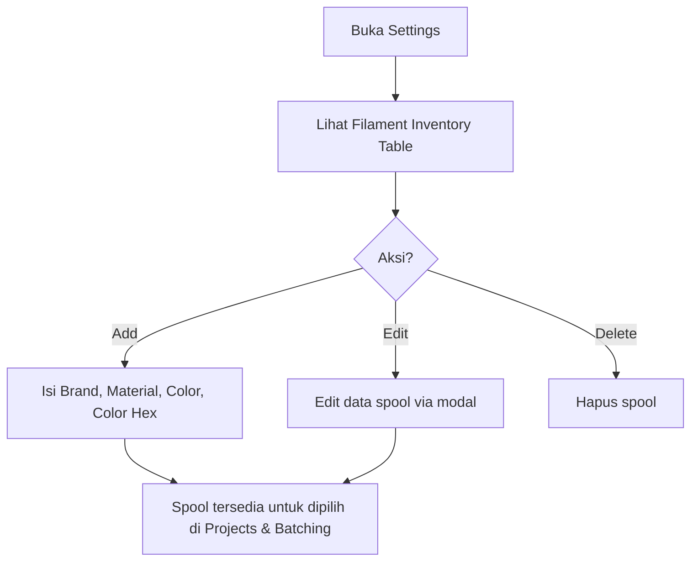
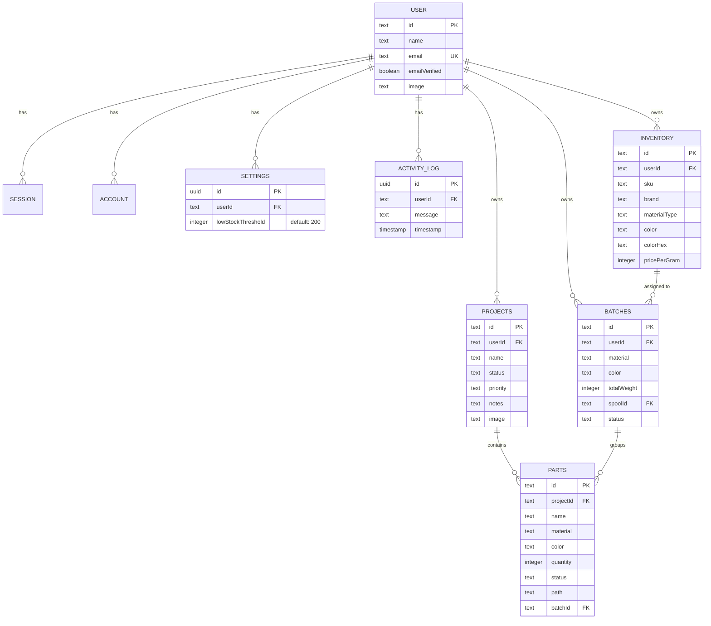

# 📋 Product Requirements Document (PRD)
# GOO-Studio — 3D Printing Project Management Platform

| Field | Detail |
|---|---|
| **Produk** | GOO-Studio |
| **Versi** | 0.0.0 (MVP / Early Development) |
| **Pemilik** | Goocanan (James) |
| **Tanggal PRD** | 2 Juni 2026 |
| **Status** | Active Development |

---

## 1. Ringkasan Eksekutif

**GOO-Studio** adalah platform manajemen proyek 3D printing berbasis web yang dirancang untuk membantu pengguna (maker/hobbyist/small studio) mengelola seluruh workflow 3D printing — mulai dari ide proyek, inventaris filamen, pengelompokan print batch secara cerdas, hingga pelacakan progres cetak. Aplikasi ini menggabungkan manajemen proyek, inventaris material, dan optimasi antrian cetak dalam satu interface yang modern dan intuitif.

> [!IMPORTANT]
> Aplikasi ini saat ini dalam tahap **MVP (Minimum Viable Product)** — beberapa fitur masih bersifat dasar dan terdapat ruang besar untuk pengembangan lebih lanjut.

---

## 2. Latar Belakang & Masalah yang Diselesaikan

### 2.1 Pain Points Pengguna 3D Printing

| Masalah | Dampak |
|---|---|
| Proyek 3D printing terdiri dari banyak komponen/part yang sulit dilacak | Kehilangan progres, lupa status cetak |
| Inventaris filamen (spool) tidak terorganisir | Kehabisan stok di tengah project, salah pilih material/warna |
| Tidak ada cara efisien untuk mengelompokkan part berdasarkan material & warna | Print tidak optimal, banyak ganti filamen yang tidak perlu |
| File 3D (STL/3MF) tersebar di berbagai folder lokal | Sulit menemukan file yang benar untuk dicetak |
| Tidak ada gambaran menyeluruh tentang status semua proyek | Prioritas kacau, proyek terlupakan |

### 2.2 Solusi GOO-Studio

GOO-Studio menyediakan **satu platform terpusat** untuk:
- Mengelola proyek dan komponen-komponennya
- Melacak inventaris filamen
- Mengelompokkan komponen secara otomatis berdasarkan material & warna (**Smart Batching**)
- Memindai dan mengelola file 3D dari sistem lokal
- Memonitor progres seluruh proyek melalui dashboard

---

## 3. Target Pengguna

| Persona | Deskripsi |
|---|---|
| **Hobbyist Maker** | Individu yang memiliki 1–3 printer 3D di rumah dan mencetak berbagai proyek secara bersamaan |
| **Small Print Studio** | Studio kecil yang mengelola pesanan dari beberapa klien dengan banyak proyek paralel |
| **Prototyper** | Engineer/designer yang sering iterasi komponen dan perlu melacak versi/material |

> [!NOTE]
> Saat ini aplikasi mendukung **single-user per akun** dengan autentikasi email/password.

---

## 4. Arsitektur Teknis

### 4.1 Diagram Arsitektur



### 4.2 Tech Stack

| Layer | Teknologi | Versi |
|---|---|---|
| **Frontend Framework** | React | 19.2.4 |
| **Build Tool** | Vite | 8.0.1 |
| **State Management** | TanStack React Query | 5.95.2 |
| **Animation** | Framer Motion | 12.38.0 |
| **3D Rendering** | React Three Fiber + Drei | 9.5.0 / 10.7.7 |
| **Icons** | Lucide React | 1.6.0 |
| **HTTP Client** | Axios | 1.13.6 |
| **Authentication** | Better Auth | 1.5.6 |
| **Backend Runtime** | Node.js + Express | — |
| **ORM** | Drizzle ORM | — |
| **Database** | PostgreSQL (Supabase) | — |
| **Deployment** | Render (Static + Web Service) | — |
| **Language** | JavaScript (FE) / TypeScript (BE) | — |

---

## 5. Fitur Utama

### 5.1 Dashboard

**Halaman:** [Dashboard.jsx](file:///c:/Users/james/Documents/Goocanan/GOO-Studio/src/pages/Dashboard.jsx)

| Fitur | Deskripsi |
|---|---|
| **Stat Cards** | 4 kartu statistik: Active Projects, Print Batches, Total Spools, Completion Rate |
| **Project Progress** | Progress bar total completion (parts done/total parts) |
| **Smart Batching Summary** | Tampilkan berat material yang perlu di-batch, link ke halaman Batching |
| **Recent Activity** | 5 aktivitas terakhir dengan relative timestamp |
| **Filament Inventory Summary** | Total stok berat filamen, link ke manage inventory |
| **Navigasi Cepat** | Klik stat card langsung navigasi ke halaman terkait |

---

### 5.2 Project Management

#### 5.2.1 Daftar Proyek

**Halaman:** [Projects.jsx](file:///c:/Users/james/Documents/Goocanan/GOO-Studio/src/pages/Projects.jsx)

| Fitur | Deskripsi |
|---|---|
| Tampilkan semua proyek dalam bentuk card grid |
| Informasi: nama, status, prioritas, jumlah parts, tanggal dibuat |
| Navigasi ke detail proyek |
| Tombol tambah proyek baru |

#### 5.2.2 Tambah Proyek Baru

**Halaman:** [AddProject.jsx](file:///c:/Users/james/Documents/Goocanan/GOO-Studio/src/pages/AddProject.jsx)

| Fitur | Deskripsi |
|---|---|
| **Basic Info** | Nama proyek, gambar (upload + optimize), priority (low/medium/high/urgent), notes |
| **Initial Parts** | Tambah parts langsung saat membuat proyek |
| **Filament Binding** | Pilih filamen dari inventory untuk setiap part |
| **File Import** | Bisa menerima data dari File Manager (pre-populate parts dari folder scan) |
| **Image Optimization** | Otomatis kompresi gambar sebelum upload ke database |

#### 5.2.3 Detail Proyek

**Halaman:** [ProjectDetail.jsx](file:///c:/Users/james/Documents/Goocanan/GOO-Studio/src/pages/ProjectDetail.jsx)

| Fitur | Deskripsi |
|---|---|
| **Hero Section** | Header visual dengan backdrop gambar proyek, status badge, priority badge |
| **Project Stats** | Components (done/total), Total Units, Progress percentage |
| **Animated Progress Bar** | Visual progress dengan gradient animation |
| **Status Management** | Ubah status proyek: Idea → Ready → Printing → Done |
| **Component Cards** | Grid cards untuk setiap part dengan 3D preview (jika file tersedia) |
| **3D Viewer** | Fullscreen 3D viewer menggunakan React Three Fiber (STL/3MF) |
| **Part CRUD** | Add, edit, delete komponen/part |
| **Part Status Toggle** | Klik badge untuk toggle status part (pending ↔ done) |
| **Inline Edit** | Edit nama proyek dan notes secara inline |
| **Photo Management** | Upload dan ganti foto proyek |
| **Configuration Section** | Project notes dan assembly instructions |

#### 5.2.4 Data Model — Projects



---

### 5.3 Smart Batching

**Halaman:** [Batching.jsx](file:///c:/Users/james/Documents/Goocanan/GOO-Studio/src/pages/Batching.jsx)

> [!TIP]
> **Smart Batching** adalah fitur unggulan GOO-Studio yang secara otomatis mengelompokkan komponen dari berbagai proyek berdasarkan kesamaan material dan warna, sehingga pengguna bisa mencetak secara efisien tanpa perlu sering mengganti filamen.

| Fitur | Deskripsi |
|---|---|
| **Suggested Groups** | Pengelompokan otomatis parts berdasarkan material + warna dari semua proyek |
| **Part Selection** | Pilih/deselect parts dalam satu grup (select all / none) |
| **Spool Assignment** | Assign spool dari inventory ke grup batch (auto-sort spool yang cocok) |
| **Material Mismatch Warning** | Peringatan jika spool yang dipilih tidak cocok materialnya |
| **Generate Print Batch** | Buat batch cetak dari grup yang dipilih |
| **Active Batches** | Lihat batch yang sedang berjalan dengan detail parts |
| **Mark Done** | Selesaikan batch → otomatis update status semua parts ke "done" |
| **Completed History** | Riwayat batch yang sudah selesai dengan opsi hapus |
| **Stats Overview** | Jumlah suggested groups, active batches, completed batches |
| **Tab Navigation** | Suggested Groups → Active Batches → Completed |

#### Data Model — Batches



---

### 5.4 Filament Inventory Management

**Dikelola via:** [Settings.jsx](file:///c:/Users/james/Documents/Goocanan/GOO-Studio/src/pages/Settings.jsx)

| Fitur | Deskripsi |
|---|---|
| **Inventory Table** | Tabel filamen dengan kolom: Brand, Material Type, Color (dengan color swatch), Actions |
| **Add Filament** | Modal form: Brand (dengan datalist 25+ brand), Material (9 tipe), Color name, Color picker |
| **Edit Filament** | Edit inline melalui modal yang sama |
| **Delete Filament** | Hapus spool dari inventory |
| **Brand Presets** | Preset temperatur untuk brand populer (eSUN, Sunlu, PolyMaker) |

#### Data Model — Inventory (Spools)



#### Material Types yang Didukung

| Material | Variasi |
|---|---|
| PLA | PLA, PLA+, PLA+ 2.0, PLA PRO |
| PETG | PETG |
| ABS | ABS |
| TPU | TPU |
| ASA | ASA |
| Nylon | Nylon |

#### Brand yang Didukung (25+)

`3D Solutech, Amolen, Anycubic, Bambu Lab, ColorFabb, Creality, Duramic 3D, Elegoo, Eryone, eSUN, Fillamentum, FlashForge, FormFutura, Geeetech, Hatchbox, Inland, Kexcelled, Kingroon, MatterHackers, Overture, PolyMaker, Prusament, SainSmart, Sunlu, ZIRO`

---

### 5.5 File Manager

**Halaman:** [FileManager.jsx](file:///c:/Users/james/Documents/Goocanan/GOO-Studio/src/pages/FileManager.jsx)

| Fitur | Deskripsi |
|---|---|
| **Directory Picker** | Pilih folder dari sistem lokal menggunakan File System Access API |
| **Recursive Scan** | Pindai folder hingga kedalaman 6 level |
| **File Type Detection** | Deteksi file 3D: `.stl`, `.3mf` |
| **Folder Tree View** | Hierarki folder interaktif dengan expand/collapse |
| **Parts Count** | Badge jumlah file 3D per folder |
| **Search/Filter** | Filter nama folder |
| **Import to Project** | Tombol "Import Project" pada folder yang berisi file 3D |
| **Connection Status** | Indikator status koneksi ke folder lokal |
| **Reset** | Hapus scan history dan putus koneksi |

> [!NOTE]
> File Manager menggunakan **File System Access API** (browser API) untuk mengakses file lokal. Data file tidak di-upload ke server — hanya metadata dan path yang disimpan.

---

### 5.6 Authentication & User Management

**Implementasi:** [Better Auth](file:///c:/Users/james/Documents/Goocanan/GOO-Studio/src/lib/auth-client.js) (Client + Server)

| Fitur | Deskripsi |
|---|---|
| **Sign Up** | Registrasi dengan email + password |
| **Sign In** | Login dengan email + password |
| **Session Management** | Automatic session handling via Better Auth |
| **Protected Routes** | Semua API endpoint di-protect oleh auth middleware |
| **Per-User Data** | Setiap data (projects, spools, batches) di-scope per userId |

#### Auth Data Model



---

### 5.7 Settings & Data Management

**Halaman:** [Settings.jsx](file:///c:/Users/james/Documents/Goocanan/GOO-Studio/src/pages/Settings.jsx)

| Fitur | Deskripsi |
|---|---|
| **Filament Inventory** | Kelola spool (lihat section 5.4) |
| **General Preferences** | Placeholder — belum ada pengaturan spesifik |
| **Export JSON** | Export seluruh data ke file JSON backup |
| **Import Data** | Import data dari file JSON |
| **Reset All** | Hapus semua data dengan konfirmasi 2 langkah |

---

### 5.8 Activity Log

| Fitur | Deskripsi |
|---|---|
| **Auto Logging** | Setiap aksi penting dicatat otomatis (create project, delete spool, create batch, dll.) |
| **Recent Feed** | 5 aktivitas terbaru ditampilkan di Dashboard |
| **Relative Timestamps** | Waktu ditampilkan secara relatif ("2 jam yang lalu") |
| **Backend Storage** | Activity log disimpan di database, bukan localStorage |

---

## 6. API Endpoints

### 6.1 Authentication

| Method | Endpoint | Deskripsi |
|---|---|---|
| `ALL` | `/api/auth/*` | Handled by Better Auth (sign-up, sign-in, session, etc.) |

### 6.2 Projects

| Method | Endpoint | Deskripsi |
|---|---|---|
| `GET` | `/api/projects` | Ambil semua proyek user (dengan parts) |
| `POST` | `/api/projects` | Buat proyek baru (dengan initial parts) |
| `PUT` | `/api/projects/:id` | Update proyek |
| `DELETE` | `/api/projects/:id` | Hapus proyek (cascade delete parts) |
| `POST` | `/api/projects/:id/parts` | Tambah part ke proyek |
| `PUT` | `/api/projects/:id/parts/:partId` | Update part |
| `DELETE` | `/api/projects/:id/parts/:partId` | Hapus part |

### 6.3 Spools (Inventory)

| Method | Endpoint | Deskripsi |
|---|---|---|
| `GET` | `/api/spools` | Ambil semua spool user |
| `POST` | `/api/spools` | Tambah spool baru |
| `PUT` | `/api/spools/:id` | Update spool |
| `DELETE` | `/api/spools/:id` | Hapus spool |

### 6.4 Batches

| Method | Endpoint | Deskripsi |
|---|---|---|
| `GET` | `/api/batches` | Ambil semua batch user (dengan parts) |
| `POST` | `/api/batches` | Buat batch baru (update part statuses) |
| `PUT` | `/api/batches/:id/complete` | Selesaikan batch (mark parts as done) |
| `DELETE` | `/api/batches/:id` | Hapus batch |

### 6.5 User

| Method | Endpoint | Deskripsi |
|---|---|---|
| `GET` | `/api/user/settings` | Ambil settings user |
| `PUT` | `/api/user/settings` | Update settings |
| `GET` | `/api/user/activity` | Ambil activity log (50 terbaru) |
| `POST` | `/api/user/activity` | Tambah activity log entry |

---

## 7. User Flows

### 7.1 Flow Utama: Proyek Baru → Cetak → Selesai



### 7.2 Flow: File Manager → Import Project



### 7.3 Flow: Inventory Management



---

## 8. UI/UX Design

### 8.1 Design System

| Aspek | Implementasi |
|---|---|
| **Theme** | Dark mode (primary) |
| **Style** | Glassmorphism (`glass-card`), gradients, modern aesthetics |
| **Colors** | Accent Primary (purple/blue gradient), Cyan, Amber, Emerald, Rose |
| **Typography** | Custom heading classes (`heading-xl`, `heading-md`, `heading-sm`) |
| **Animation** | Framer Motion untuk page transitions, list animations, modal animations |
| **Responsive** | Sidebar (desktop) + Bottom Navigation (mobile) |
| **Components** | Glass cards, gradient text, animated progress bars, modal overlays, tag/badge system |

### 8.2 Navigasi

| Platform | Navigasi |
|---|---|
| **Desktop** | Sidebar kiri permanen dengan icon + label |
| **Mobile** | Bottom navigation bar dengan 5 icon tabs |

### 8.3 Halaman

| Halaman | Path State |
|---|---|
| Dashboard | `dashboard` |
| Projects | `projects` |
| Add Project | `add-project` |
| Project Detail | `project-detail` (+ `selectedProjectId`) |
| Smart Batching | `batching` |
| File Manager | `files` |
| Settings | `settings` |

> [!NOTE]
> Navigasi menggunakan **state-based routing** (bukan React Router). State page disimpan di `localStorage` untuk survive page refresh.

---

## 9. Deployment & Infrastructure

### 9.1 Render Configuration

| Service | Type | Detail |
|---|---|---|
| **goo-studio-api** | Web Service (Node) | Backend API, free plan |
| **goo-studio-frontend** | Static Site | Frontend SPA, build output dari `dist/` |

### 9.2 Environment Variables

| Variable | Service | Deskripsi |
|---|---|---|
| `DATABASE_URL` | Backend | Supabase PostgreSQL connection string |
| `BETTER_AUTH_SECRET` | Backend | Random secret untuk auth |
| `BETTER_AUTH_URL` | Backend | URL backend untuk auth callbacks |
| `FRONTEND_URL` | Backend | URL frontend untuk CORS |
| `VITE_API_BASE_URL` | Frontend | URL API backend |
| `PORT` | Backend | 10000 (Render default) |
| `NODE_VERSION` | Backend | 20 |

### 9.3 Cold Start Handling

Aplikasi menampilkan **loading screen** dengan pesan bertahap saat Render server bangun dari hibernation (free tier):

1. *"Awakening our servers..."*
2. *"Connecting to Supabase..."*
3. *"Retrieving your 3D Projects..."*
4. *"Almost there, finalizing GOO-Studio..."*

---

## 10. Skema Database Lengkap



---

## 11. Non-Functional Requirements

| Requirement | Target | Status |
|---|---|---|
| **Responsiveness** | Mobile-friendly (bottom nav + responsive grid) | ✅ Implemented |
| **Performance** | Image optimization sebelum upload (max 1200px, 0.8 quality) | ✅ Implemented |
| **Data Persistence** | State navigasi di localStorage, data di PostgreSQL | ✅ Implemented |
| **Error Handling** | ErrorBoundary di root level, try-catch di semua service | ✅ Implemented |
| **JSON Payload Limit** | 50MB untuk support base64 images | ✅ Implemented |
| **CORS** | Allow all origins with credentials | ✅ Implemented |
| **Loading UX** | Animated loading screen untuk cold start | ✅ Implemented |

---

## 12. Gap Analysis & Rekomendasi Pengembangan

### 12.1 Fitur yang Belum Ada / Perlu Ditingkatkan

| Area | Gap | Prioritas | Rekomendasi |
|---|---|---|---|
| **Routing** | Tidak ada URL routing (state-based only) | 🟡 Medium | Implementasi React Router untuk deep linking & browser history |
| **Weight Tracking** | Field `weight` ada di schema tapi belum digunakan di UI | 🔴 High | Tambah input weight per part untuk tracking penggunaan filamen |
| **Spool Consumption** | Tidak ada tracking penggunaan filamen per spool | 🔴 High | Track remaining weight spool setelah batch selesai |
| **Print Time Estimation** | Tidak ada estimasi waktu cetak | 🟡 Medium | Integrasikan estimasi waktu dari slicer output |
| **Multi-User / Team** | Single user only | 🟢 Low | Tambah role-based access untuk tim/studio |
| **Notifications** | Tidak ada notifikasi | 🟡 Medium | Push notifications untuk low stock, batch completion |
| **Search Global** | Tidak ada search across projects | 🟡 Medium | Implementasi global search |
| **Cost Tracking** | `pricePerGram` ada tapi tidak digunakan | 🟡 Medium | Hitung estimasi biaya per proyek/batch |
| **General Preferences** | Halaman preferences kosong | 🟢 Low | Tambah theme toggle, bahasa, unit preferences |
| **QR Labels** | File `QRLabels.jsx` ada tapi tidak ter-route | 🟡 Medium | Aktivasi fitur QR label untuk identifikasi spool fisik |
| **Spool Detail** | File `SpoolDetail.jsx` ada tapi tidak ter-route | 🟡 Medium | Aktivasi halaman detail spool dengan usage history |
| **Smart Batching** | File `SmartBatching.jsx` ada tapi tidak ter-route | 🟡 Medium | Evaluasi apakah ini versi alternatif atau upgrade |
| **Image Storage** | Gambar disimpan sebagai base64 di database | 🔴 High | Migrasi ke object storage (Supabase Storage / S3) |
| **File Upload** | File 3D hanya di-referensi via local path | 🟡 Medium | Implementasi upload ke cloud untuk akses cross-device |
| **Testing** | Tidak ada unit/integration tests | 🔴 High | Tambahkan test suite (Vitest/Jest) |
| **API Validation** | Tidak ada input validation di backend | 🔴 High | Tambahkan Zod/Joi validation di routes |
| **Login Page** | File `Login.jsx` ada tapi flow autentikasi tidak terlihat di App.jsx | 🔴 High | Implementasi login/register flow yang proper |

### 12.2 Halaman yang Ada di Codebase Tapi Belum Ter-route

| File | Status |
|---|---|
| [QRLabels.jsx](file:///c:/Users/james/Documents/Goocanan/GOO-Studio/src/pages/QRLabels.jsx) | ⚠️ Tidak ter-route di App.jsx |
| [SpoolDetail.jsx](file:///c:/Users/james/Documents/Goocanan/GOO-Studio/src/pages/SpoolDetail.jsx) | ⚠️ Tidak ter-route di App.jsx |
| [SpoolInventory.jsx](file:///c:/Users/james/Documents/Goocanan/GOO-Studio/src/pages/SpoolInventory.jsx) | ⚠️ Tidak ter-route di App.jsx |
| [SmartBatching.jsx](file:///c:/Users/james/Documents/Goocanan/GOO-Studio/src/pages/SmartBatching.jsx) | ⚠️ Tidak ter-route di App.jsx |
| [Login.jsx](file:///c:/Users/james/Documents/Goocanan/GOO-Studio/src/pages/Login.jsx) | ⚠️ Tidak ter-route di App.jsx |

---

## 13. Metrics & KPIs

| Metric | Cara Ukur |
|---|---|
| **Project Completion Rate** | `(doneParts / totalParts) × 100` |
| **Active Projects** | Count projects with status ≠ "done" |
| **Active Batches** | Count batches with status ≠ "completed" |
| **Total Spools** | Count inventory items |
| **Pending Weight** | Sum of material weight yang belum di-batch |

---

## 14. Appendix

### 14.1 File Structure

```
GOO-Studio/
├── src/                          # Frontend
│   ├── App.jsx                   # Main app + routing logic
│   ├── main.jsx                  # Entry point
│   ├── index.css                 # Global styles (61KB - comprehensive design system)
│   ├── api/                      # API service layer
│   │   ├── client.js             # Axios instance
│   │   ├── projects.service.js   # Project API calls
│   │   ├── spools.service.js     # Spool API calls
│   │   ├── batches.service.js    # Batch API calls
│   │   └── user.service.js       # User/settings API calls
│   ├── components/
│   │   ├── layout/               # Sidebar, BottomNav
│   │   ├── project/              # Project-specific components
│   │   ├── spool/                # Spool-specific components
│   │   └── ui/                   # ThreeDViewer, ModelPreview
│   ├── hooks/                    # Custom React hooks
│   │   ├── useProjects.js        # Projects + parts + batches state
│   │   ├── useSpools.js          # Spools + settings + activity state
│   │   └── useFileManager.js     # File System Access API
│   ├── lib/
│   │   ├── auth-client.js        # Better Auth client
│   │   ├── constants.js          # Materials, brands, presets, sample data
│   │   └── utils.js              # Formatting, image optimization
│   └── pages/                    # Page components (12 files)
├── backend/                      # Backend
│   └── src/
│       ├── app.ts                # Express app + middleware
│       ├── index.ts              # Server entry
│       ├── config/               # Auth config
│       ├── db/
│       │   ├── index.ts          # Drizzle client
│       │   └── schema.ts         # Database schema (7 tables)
│       ├── middleware/            # Auth middleware
│       ├── routes/               # API routes (4 routers)
│       └── services/             # Business logic (4 services)
├── render.yaml                   # Render deployment config
├── package.json                  # Frontend dependencies
└── vite.config.js                # Vite configuration
```

### 14.2 ID Format Convention

| Entity | Format | Contoh |
|---|---|---|
| Project | `PRJ-{timestamp4}-{random4}` | `PRJ-1234-AB3F` |
| Part | `PART-{timestamp4}-{random4}` | `PART-5678-XY2Z` |
| Batch | `BATCH-{timestamp4}-{random4}` | `BATCH-9012-CD4E` |
| Spool | `SPL-{timestamp4}-{random6}` | `SPL-3456-FGHIJK` |

---

> [!IMPORTANT]
> **Dokumen ini dibuat berdasarkan analisis kode sumber per 2 Juni 2026.** Fitur dan arsitektur dapat berubah seiring pengembangan. Mohon update PRD ini setiap kali ada perubahan signifikan.
